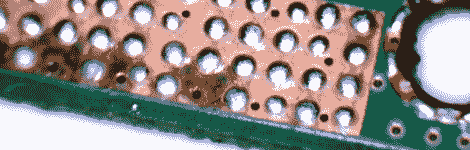

# 黑客日链接:2010 年 9 月 19 日

> 原文：<https://hackaday.com/2010/09/19/hackaday-links-september-19-2010/>

**6502 闸门模拟器**

****

想知道程序执行时芯片内部发生了什么吗？现在，您可以用这个用于 6502 处理器的[视觉门模拟器来看看芯片本身。[感谢普利和斯沃夫斯基]](http://visual6502.org/JSSim/index.html)

**铜腐蚀**

****

打开他的船坞之星去寻找被腐蚀的铜。似乎希捷留下了一部分未受保护的接地层，它与屏蔽金属发生了严重反应。如果你有[这样的设备](http://hackaday.com/2010/07/17/openwrt-on-a-seagate-freeagent-dockstar/)，你可能想把它敲开，然后给暴露的铜上锡，这样它就能支撑一段时间。

**赛格威支架**

****

不想让你的赛格威在你停车的时候翻倒？跟随[Paul]的领导，为自动平衡器建造[支架。你可以从上面的图片中分辨出来。这是一个哑铃，当你不在车上时，它可以从车把管上折叠下来。](http://www.youtube.com/watch?v=ldAiuuV922Y)

**特斯拉让一切变得更好**

****

你喜欢钢铁侠这首歌吗？我们认为我们的朋友尼古拉参加会更好。

**禁止吸烟**

****

吸烟对你真的很不好。另外，你不可能像这种机械吸烟机那样有效地吸烟，所以不要尝试。[谢谢费迪南]