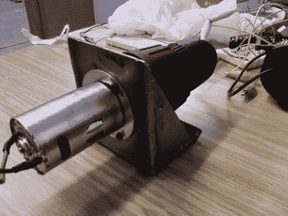

# 增强廉价的钻机马达

> 原文：<https://hackaday.com/2010/09/20/beefing-up-a-cheap-drill-motor/>

[Rob]刚刚完成[加固一个便宜的电钻马达](http://makeitlabs.com/forum/viewtopic.php?f=8&t=7)。他在港口货运公司拿起工具，扔掉了箱子。塑料扣环被一个厚的金属垫圈代替，垫圈用三个螺栓固定在焊接在一起的安装板上。我们不确定他在想什么，因为他只提到这将用于机器人。我们不介意有一个这样的马达作为台式马达，但现在它肯定有数百种用途，可以连接到任何东西上。似乎港口货运已经成为黑客的原材料来源。我们看到的最后一个例子是[一个由多功能手推车](http://hackaday.com/2010/08/01/multi-purpose-welding-cart/)制成的焊接台。