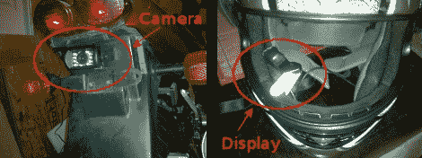

# 带头盔显示器的摩托车后视

> 原文：<https://hackaday.com/2010/09/20/motorcycle-rear-view-with-in-helmet-display/>

想在骑运动自行车时，眼睛不离开路面就能看到身后的情况吗？他们为此制造后视摄像头，但[Nescioqd]希望[在他的头盔上安装一个后视显示器(PDF)](http://blog.mahalo.com/hackaday/misc/hmd.docx)。他首先在自行车后面安装了一个后置摄像头，由尾灯的 12V 电源供电。在显示器方面，他拿起了一个 Myvu 水晶可穿戴显示器。这就像一副配有小 LCD 屏幕的眼镜，而镜片本来应该是这样的。[Nescioqd]取下一个镜头，安装在头盔内。

由于显示器位于头盔内部，所以在夜间，眼球下方的明亮屏幕会让人有些担心。[Nescioqd]实际上一开始就碰到了相反的问题，明亮的阳光使得很难看到液晶屏上的图像。他通过拿起深色头盔护目镜(最简单的解决方案)解决了这个问题，但我们希望看到一个光敏电阻用于调节背光水平。

看到两个屏幕都被使用会很有趣，一边是后视，另一边是仪表显示器。