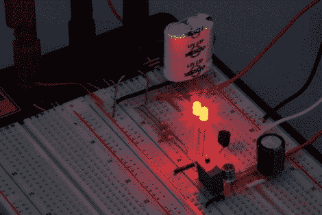

# 讨论脉宽调制

> 原文：<https://hackaday.com/2010/09/21/discussing-pulse-width-modulation/>

[Michael Kleinigger]发表了一篇关于脉宽调制的冗长讨论,这超出了传统的初学者教程。他介绍了一些关于 PWM 的背景信息，以及一个使用相机判断 led 频率和占空比的技巧。从那里开始，就像兔子洞一样，测试功率损耗与频率的关系。

当频率从 50 Hz 变为 1 MHz 时，开关产生的寄生功耗会如何影响电路的整体效率？结果是，在最高水平有相当大的损耗，大约 1.5 mW。低功耗和消除闪烁的最佳平衡似乎在 300-500 Hz 范围内。