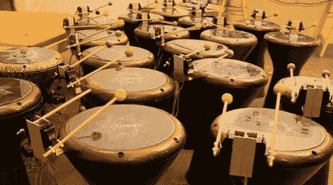

# 达布卡乐队

> 原文：<https://hackaday.com/2010/09/22/darbuka-band/>

这个机器人乐队有着恰到好处的鼓。[Liat]和她的同事用一对伺服驱动的木槌安装了一组 [Darbuka](http://en.wikipedia.org/wiki/Goblet_drum) [鼓](http://en.wikipedia.org/wiki/Goblet_drum)。我们很惊讶，伺服电机实现了如此成功的罢工和反弹，而没有抑制鼓头的振动。这更多的是通过螺线管实现的[，因为它们的快速响应和相对强度。](http://hackaday.com/2009/11/13/auto-drummer/)

休息之后，你可以在视频中听一听这个正在进行中的作品的表演，或者计划现场观看。这个装置是为 Bat-Yam 国际景观都市双年展建造的。它将附属于太阳能电池和风力涡轮机等替代能源生产商，并由其提供动力。T3[https://www.youtube.com/embed/uqecHPnvb6c?version=3&rel=1&showsearch=0&showinfo=1&iv_load_policy=1&fs=1&hl=en-US&autohide=2&wmode=transparent](https://www.youtube.com/embed/uqecHPnvb6c?version=3&rel=1&showsearch=0&showinfo=1&iv_load_policy=1&fs=1&hl=en-US&autohide=2&wmode=transparent)