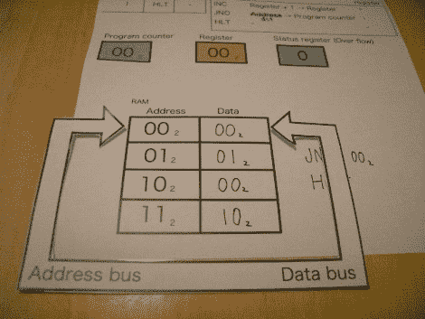

# 2 位纸张处理器教他们如何工作

> 原文：<https://hackaday.com/2010/09/23/2-bit-paper-processor-teaches-how-they-work/>

抽出几分钟时间，拿起剪刀，学习简单的处理器是如何工作的。[斋藤裕]用纸做了一个教处理器操作的练习。下载 PDF 后，您可以剪切出地址和数据指针以及每个的两位数据令牌。处理器有三个指令集；将寄存器递增 1，如果没有溢出就跳转，并停止等待复位。

一旦你有了你的剪贴，你就可以在程序执行的时候跟着做了。运行 INC 操作，用 JNO 循环程序。一旦寄存器溢出，溢出计数器就停止程序。

提醒一句，我们认为其中一个标题有一个印刷错误。一旦程序开始运行并到达地址 01(2 ),地址和数据的标题仍然为 00(2)。只要你一路比较图中的值，你应该没有问题通过执行。现已修复。