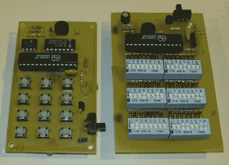

# RFID 读取器、写入器和欺骗器

> 原文：<https://hackaday.com/2010/09/25/rfid-readers-writers-and-spoofers/>

[Carl]做了大量工作来开发一系列 RFID 硬件。你在上面看到的两张卡是欺骗器，可以在现场使用左边的键盘或右边令人生畏的 DIP 开关进行编程。我们也很欣赏他对用于标签本身的 Atmel T5557 和 ATA5567 卡上芯片的看法。他分享了他的设计原理图，但不幸的是，他没有分发固件。尽管如此，如果您有兴趣了解更多关于 RFID 的知识，这是一个很好的资源，因为它涵盖了阅读器、编写器、欺骗器和标签。