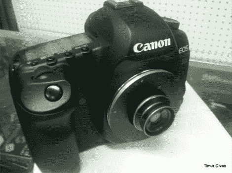
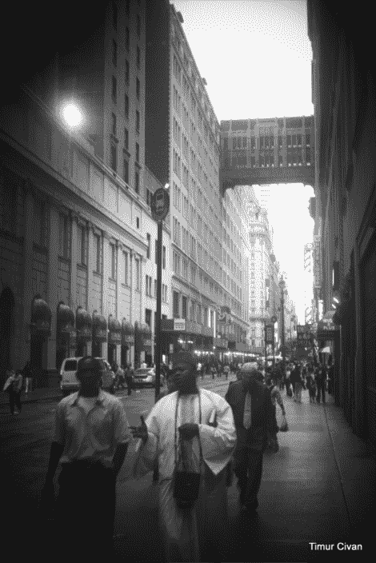
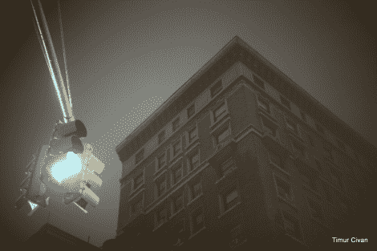
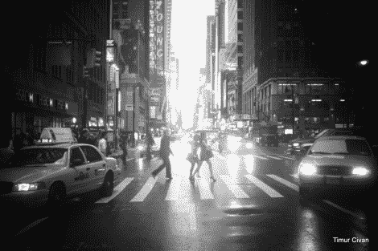

# 从电影到剧照，镜头获得新生

> 原文：<https://hackaday.com/2010/09/26/from-cinema-to-stills-camera-lens-gets-new-life/>

[帖木儿·西万][将过去与现在](http://www.cinema5d.com/viewtopic.php?f=30&t=20638&st=0&sk=t&sd=a)完美融合，他拿起一个 102 年前的相机镜头(手摇影院相机的 35mm F5.0)并将其安装在他的佳能 EOS 5D 相机上。虽然这不是我们第一次看到有人定制相机镜头或将镜头安装到不同的相机上，比如当我们为您带来[铅管倾斜移位](http://hackaday.com/2009/07/28/making-a-tilt-shift-lens/)或 [iPhone 相机单反](http://hackaday.com/2009/12/01/double-dose-of-iphone-camera-hacks/)或[品客薯片可以微距摄影](http://hackaday.com/2008/11/12/pringles-can-macro-photography/)时，新旧技术的融合温暖了我们空虚的胸腔的心灵。捕捉一些跳跃后的 1908/2010 年纽约市的附加镜头。

