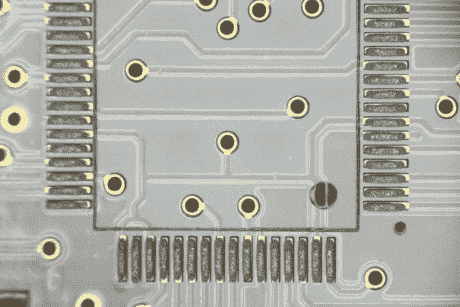

# 锡膏操作指南

> 原文：<https://hackaday.com/2010/09/28/solder-paste-how-to-tutorial/>

焊膏的[应用是小批量制造和原型制作的重要部分。从 PCB 车间拿回裸板后，是时候进入正题，组装这些板了。这个新的教程集假设你有机会接触到一些东西，比如你的电路板上的模版，但是确实提到了一些关于购买模版的商业途径的资源。当然，如果你有激光切割机，我们可以](http://www.microbuilder.eu/Tutorials/microManufacturingProcess/SolderPaste.aspx)[帮你搞定](http://hackaday.com/2010/03/19/laser-cutting-solder-stencils/)。拿到锡膏印章后，一定要看看我们的[烤面包机回流焊](http://hackaday.com/2008/10/22/reflowing-with-a-toaster/)指南。

[感谢 p .托伦]