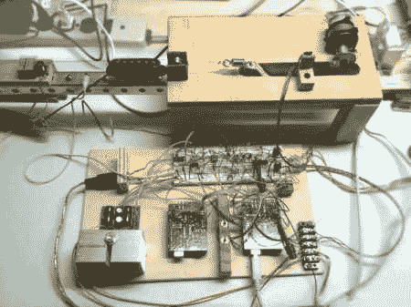

# 单弦伺服电吉他

> 原文：<https://hackaday.com/2010/09/28/single-string-servo-electric-guitar/>

啊，我们喜欢真正播放音乐的音乐黑客。[迈克·巴克斯特]带着一把新的伺服电吉他回来了。这个叫做[物理弦合成器](http://www.servoelectricguitar.com/singlestring.php)，只有一根弦。他用两个 Arduinos 来控制这个装置。一个是将 midi 文件更改为弦乐限制内的音符，另一个是实际控制伺服。这似乎可以简化一点，但我们很确定他的最终目标是快速建造一个仪器，而不是学习成为一个电路忍者。上次我们见到迈克·巴克斯特时，他已经为[制作了一把伺服电吉他，用键盘控制](http://hackaday.com/2009/11/06/servoelectric-guitar-is-a-keytar-with-strings/)。休息之后你可以看到一段单弦一的视频。

 <https://www.youtube.com/embed/PrcGkLtNsY0?version=3&rel=1&showsearch=0&showinfo=1&iv_load_policy=1&fs=1&hl=en-US&autohide=2&wmode=transparent>

 
[via <a href="http://hackedgadgets.com/2010/09/26/single-string-servo-guitar/" target="_blank"> HackedGadgets </a>
 </body> </html>