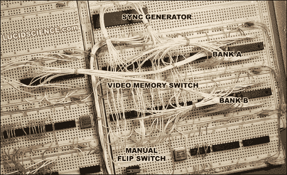

# Lazarus-64，实际上不是 64 位，但仍然让我们大吃一惊

> 原文：<https://hackaday.com/2010/09/29/lazarus-64-not-actually-64-bit-but-still-blows-our-minds/>

拉扎勒斯-64，面包板游戏系统；当然[听起来像是上世纪 80 年代的东西](http://www.lucidscience.com/pro-lazarus-64%20prototype-1.aspx)。我们惊讶地发现，不仅是名称，而且所有使用的 IC 都是 30 年前的产品(当然，除了控制一切的 AVR)。更令人惊讶的是，它不使用 NTSC 芯片，却支持 256 种无闪烁色彩。这表明，即使有便宜的通用解决方案，构建或编译自己的解决方案也不一定是坏事或浪费时间。

Lazarus 还有更多的功能，包括双缓冲和虚拟机，但遗憾的是，Lazarus-64 试验版游戏系统的进展似乎已经停止，上次更新是在去年。但我们仍然可以沐浴在当前令人惊叹的光芒中。