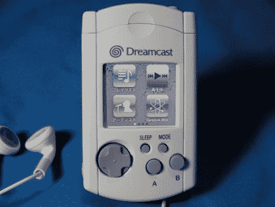

# VMU 梦之队，来见见 IPod

> 原文：<https://hackaday.com/2010/09/29/dreamcast-vmu-meet-ipod/>

我们敢打赌你从来没有过 Dreamcast 视觉记忆单元，但如果你现在能找到一个[，它可以变成一个 iPod](http://goteking.web.infoseek.co.jp/jyank/vm_nano/vm_nano.html) ( [翻译](http://translate.google.com/translate?hl=en&sl=auto&tl=en&u=http://goteking.web.infoseek.co.jp/jyank/vm_nano/vm_nano.html))。 [VMU](http://en.wikipedia.org/wiki/Dreamcast_VMU) 最初是一款不太受欢迎的游戏控制台的存储卡，它将一个 LCD 屏幕放在你的控制器中。当你不在家的时候，你可以带着它玩迷你游戏。这一版本缺乏其原始的胆量，已被第六代 iPod nano 取代。屏幕对于开口来说有点小，所以用了一圈白色胶带作为边框。睡眠按钮已经延伸穿过 VMU 连接器的盖子。似乎有一个大洞在后面的情况下，但在看到超声刀用来切断塑料，我们不在乎。休息之后我们嵌入了该工具的视频。

 <https://www.youtube.com/embed/BcA2qQvGoF8?version=3&rel=1&showsearch=0&showinfo=1&iv_load_policy=1&fs=1&hl=en-US&autohide=2&wmode=transparent>

 
[via <a href="http://www.reddit.com/r/geek/comments/djlyp/guy_crams_a_sixthgen_ipod_nano_into_a_dreamcast/" target="_blank"> Reddit </a>
 </body> </html>