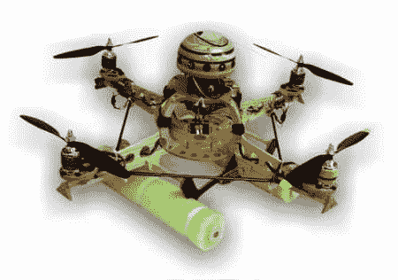

# 木制四轴飞行器机身

> 原文：<https://hackaday.com/2010/09/30/wooden-quadcopter-body/>

[Greasetattoo]分享了他建造木制四轴飞行器机身的过程，该机身在明尼苏达州博览会上获得了第二名。早在 1999 年，他的计划就作为一个工具包被购买了，但他从未真正着手建造它们。最初的计划需要一个泡沫板主体，但他觉得木制艺术品会更好。这个构建并不关注电子设备，它们只是 Mikrokopter 的一个工具包。相反，它是制作美丽的木制身体的整个过程的日志。他真的在那里放了一些很好的细节，从分层的和完美的圆顶到他的马达的小橡木套。干得好[Greasetattoo]。