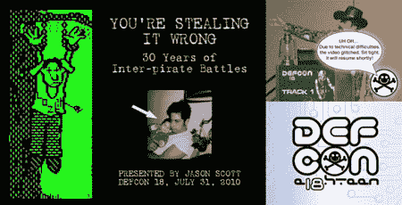

# 你弄错了:杰森·斯科特的演讲

> 原文：<https://hackaday.com/2010/10/01/youre-stealing-it-wrong-a-speech-by-jason-scott/>

杰出的数据历史学家杰森·斯科特在 Defcon 18 上发表了这个精彩的演讲，讲述了海盗间的盗版历史。在一个小时长的时间里，这是一个迷人的计算机历史之旅，特别是关于盗版。坐下来，不管你对安全和盗版了解多少，你都可能学到一些东西。我们发现较少讨论的问题，如盗版者窃取其他盗版者的工作很有趣，以及盗版者必须破解非常无聊的软件才能发布的部分，当没有更好的存在时。同样值得注意的是，根据[Jason]的说法，演示场景是从裂缝中的小开口序列演化而来的。这里有太多有趣的地方值得注意，甚至是在 BBS 上的一些色情相关的故事。

这是一个既有知识又有娱乐性的人给我们上的一课。[Jason]教授这些东西，不会让人觉得沉闷、无聊或过于专业。休息后看视频。

<https://player.vimeo.com/video/15400820>

 </body> </html>