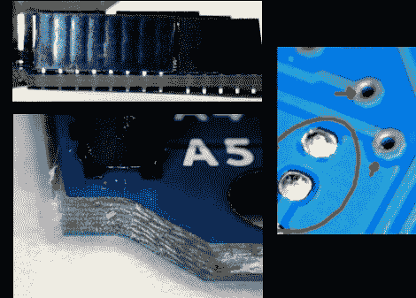

# 下一代 Arduino 制造问题？

> 原文：<https://hackaday.com/2010/10/01/next-generation-arduino-manufacturing-problems/>

刚刚得到他的新 Arduino Uno 哇，真快。当他仔细查看电路板时，本该是愉快的拆箱过程变得不愉快了。它似乎展示了几个草率制造的例子。左下角的图像显示了不干净的电路板走线、变色的边缘和从角落伸出的尖齿。左上角所示的屏蔽接头与电路板不齐平，导致物理结合较弱，连接弯曲。有些通孔看起来不在阻焊膜的中心，有些区域暴露出未加工的铜。

看到这一点我们很难过，因为最初的 Arduino 电路板制造得非常好。请记住，这可能是一个孤立的案例，到目前为止，该公司还没有机会更换通过更严格的质量控制检查的主板。但是如果你已经自己订了一个，仔细看看，确保你在到达时对它感到满意。

不确定我们所说的下一代 Arduino 是什么意思？看看最近亮相的新硬件。

**更新:**这是来自 Arduino 博客的[的直接回应。](http://arduino.cc/blog/2010/10/01/one-bad-arduino-doesnt-spoil-the-barrel/)

**更新#2:** 【马西莫·班兹】[Arduino 的创始人之一，花时间在这篇帖子上评论](http://hackaday.com/2010/10/01/next-generation-arduino-manufacturing-problems/#comment-188989)。它详细描述了该组织愿意补救像[Moogle]遇到的情况，还链接到最近的 Arduino 博客帖子。