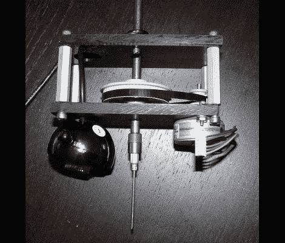

# 开源取放

> 原文：<https://hackaday.com/2010/10/01/open-source-pick-and-place/>

这是一个用于开源拾放的[真空镊子头。专业印刷电路板制造商使用这些机器在电路板进入回流焊炉之前向电路板填充元件。[Drmn4ea]在制造时考虑到了在家快速制造。左边的黑色球体是一个用于光学放置的网络摄像头。中间的针是一个可互换的真空工具头。右边的马达允许自动更换不同的附件，以适应不同的零件。](http://www.thingiverse.com/thing:4070)

这与 3 轴 CNC 机器接口，并且应该容易与 RepRap、Makerbot 或类似设备兼容。我们想知道他打算如何处理组件卷轴，但这是在通往完整解决方案的旅程中执行良好的第一步。

想在工作中看到一个专业的挑选和放置？休息过后，看看 SparkFun 的一台机器正忙着搭建一块板子。