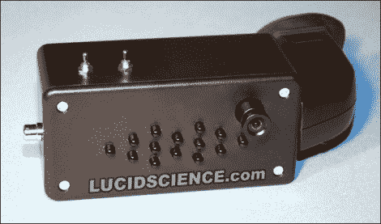

# DIY 夜视单片眼镜

> 原文：<https://hackaday.com/2010/10/02/diy-night-vision-monocle/>

这个有趣的混搭展示了制作自己的夜视镜很容易。它只使用了几个部分；一个旧摄像机的取景器，一个弱光安全相机模块，和一组红外发光二极管。

弱光相机能够探测到我们肉眼看不到的红外光。如果你将正确的红外发光二极管照射到一个物体上，它们会发出足够的光，让相机清楚地观察你周围的物体。摄录机取景器只不过是一种显示相机所见的紧凑方式。这很容易通过可穿戴显示器来实现。拥有一个大的红外光源也是有益的，所以你可以考虑修改[你一直打算建造的那个巨型 LED 手电筒](http://hackaday.com/2010/03/26/thats-a-big-flashlight/)，使其在红外波长下工作。

这个项目与我们上个月看到的激光麦克风来自同一个来源。就像那个一样，有很多关于这个建筑的额外信息。有一些选择和聚焦光源的建议。这包括使用激光作为光源，使用双筒望远镜进行远距离观察。