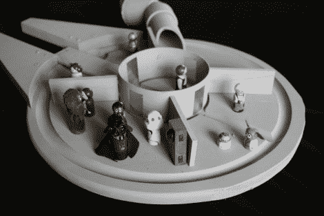

# 千年隼玩偶屋

> 原文：<https://hackaday.com/2010/10/03/millennium-falcon-doll-house/>

有时候只需要一个想法。在旧货店发现的切菜板的形状促使[保罗]建造了一个千年猎鹰娃娃屋。除了形状奇怪的切菜板，一个来自 CD 主轴的环和一些木板条划分内部，而 PVC 配件完成驾驶舱组装。为了给孩子们带来真实的生活，[林]用图钉给做了一堆小玩偶。这些展示了她的艺术技巧，因为我们认为它们比你在商店里能买到的大多数东西都要好。

孩子们真的能在黑客方面发挥出最好的水平。看起来这些孩子已经享受了黑客父母的战利品有一段时间了，一个纸板火箭飞船(轻而易举地击败任何冰箱盒子)[、使用一些小 LED 比特的仙尘瓶](http://www.fangletronics.com/2010/05/pixie-dust-bottles.html)，以及一个重新利用酒架的[玩偶床](http://www.fangletronics.com/2010/06/upcycling-wine-rack-to-doll-bed.html)。

[谢谢 Joby]