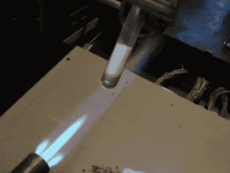

# 硫化锌家用发光电源

> 原文：<https://hackaday.com/2010/10/03/zinc-sulfide-glow-power-at-home/>

为了进一步巩固她疯狂科学家的形象，[Jeri Ellsworth]正在用家用化学品制作发光粉。当我们看到视频的标题时，我们认为自己尝试一下会很有趣，但最初的几分钟让我们害怕。

为了收集原材料，她将一些硬币放入一台台式马达中，然后将它们锉成粉末。从那里开始，用不同的清洁剂和工具反复试验，创造出恰到好处的危险反应，以获得她所寻找的化学性质。

休息之后看看她的实验。如果你发现你想要更多，回去看看[她的 EL 线制作过程](http://hackaday.com/2010/08/15/making-el-wire/)。

[https://www.youtube.com/embed/veOiHb-KuSE?version=3&rel=1&showsearch=0&showinfo=1&iv_load_policy=1&fs=1&hl=en-US&autohide=2&wmode=transparent](https://www.youtube.com/embed/veOiHb-KuSE?version=3&rel=1&showsearch=0&showinfo=1&iv_load_policy=1&fs=1&hl=en-US&autohide=2&wmode=transparent)