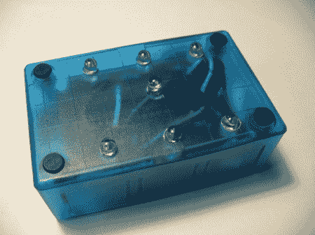

# 电子骰子，矫枉过正，简单化

> 原文：<https://hackaday.com/2010/10/04/electronic-dice-overkill-and-simplified/>

【littlebird】贴了一个[制作电子骰子](http://blog.littlebirdelectronics.com/project-lets-make-electronic-dice)的教程。他用 ATmega328 做数字工作，用水银开关来启动它。一个漂亮的蓝色外壳，配合他用于数字显示的蓝色发光二极管，很好地包装了它。当然，有人不得不提到，这是一个惊人的过量杀伤，它可以用 555 定时器来完成，就像他们过去做的那样。[littlebird]用另一个教程回应了[，以证明他没有忘记如何从基础做起。他继续指出，现在我们看到了两者的实际应用，他可以用几行代码快速扩展基于微控制器的定时器，其中添加到 555 定时器版本的每个新功能都需要额外的组件。](http://blog.littlebirdelectronics.com/quick-project-20th-century-electronic-dice)

休息之后你可以观看两者的视频。

 <https://www.youtube.com/embed/BYCv0avM-uQ?version=3&rel=1&showsearch=0&showinfo=1&iv_load_policy=1&fs=1&hl=en-US&autohide=2&wmode=transparent>

 <iframe class="youtube-player" width="800" height="480" src="https://www.youtube.com/embed/E3qwNPPrAQ0?version=3&amp;rel=1&amp;showsearch=0&amp;showinfo=1&amp;iv_load_policy=1&amp;fs=1&amp;hl=en-US&amp;autohide=2&amp;wmode=transparent" allowfullscreen="true" style="border:0;" sandbox="allow-scripts allow-same-origin allow-popups allow-presentation"/> </body> </html>