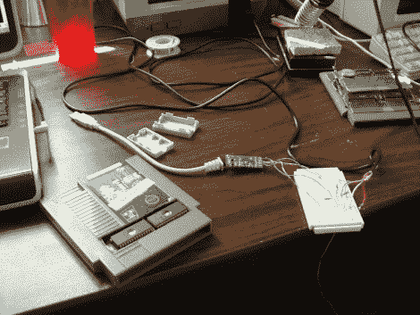

# 孟乔森让 NES 成为一名盒式磁带程序员

> 原文：<https://hackaday.com/2010/10/05/munchausen-makes-nes-a-cartridge-programmer/>

多么美丽的 NES 墨盒图像显示他们的私人部分。这些是 Munchausen 闪存墨盒项目的原材料。一个改进的游戏卡带和特殊的 USB 电缆的组合使得在未改进的控制台中对 NES 卡带进行编程成为可能。盒式磁带增加了一个运行引导加载程序的闪存芯片。通过将 USB-NES 电缆连接到第二控制器端口，可以将游戏图像(或定制代码图像)闪存到可写盒上的三个游戏槽中的一个。开机时，引导加载程序会提供一个菜单，供您在三个存储的映像之间进行选择，或者在控制台打开时，按住 A，直接进入之前选择的映像。甚至有一个恢复程序以防出现问题。休息后请欣赏演示。

我们从论坛帖子中发现的一件有趣的事情是，从技术上讲，从 PC 直接在 NES 上运行代码是可能的。这肯定会让在 nes 上现场演奏 chiptunes 变得容易。

 <https://www.youtube.com/embed/g1rB2BZTg3o?version=3&rel=1&showsearch=0&showinfo=1&iv_load_policy=1&fs=1&hl=en-US&autohide=2&wmode=transparent>

 
[Tha
 </body> </html>