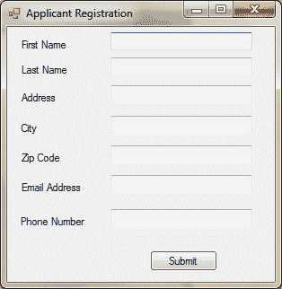
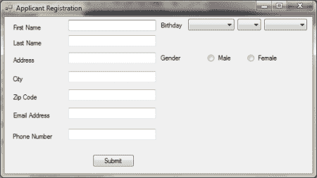

# 夏普开发 101-第 2 部分:工具箱控件

> 原文：<https://hackaday.com/2010/10/15/c-sharp-development-101-part-2-toolbox-controls/>

In this tutorial we are going to start finding out more about the toolbox we utilized in the [previous tutorial](http://bit.ly/CSharp1011).  The Controls available in the toolbox are quite extensive and allow users to simplify a variety of everyday tasks such as manually creating and instantiating a textbox on a windows form.  At the end of this tutorial you should be comfortable finding Controls in the Visual Studio Toolbox, alter or produce code to link tools together using event handlers and ultimately get a better sense of Visual Studio, it’s layout and how to easily navigate it.

首先，我们将在名为 ApplicantRegistration 的新解决方案中创建一个新的 Windows 窗体应用程序项目。创建项目后，我们需要将表单的名称从 Form1 更改为 main，并将表单顶部的名称更改为 Properties 选项卡中 text 下的 Applicant Registration。然后，我们可以开始添加标签并更改以下内容的文本和名称属性:

*   名字(文本:名字，名称:lblFirstName)
*   姓氏(文本:姓氏，姓名:lblLastName)
*   地址(文本:地址，名称:lblAddress)
*   City (Text: City, Name: lblCity)
*   邮政编码(文本:邮政编码，名称:lblZipCode)
*   电子邮件地址(文本:电子邮件地址，名称:lblEmail)
*   电话号码(文本:电话号码，姓名:lblPhone)

完成标签后，我们需要添加与标签相符的文本框。当我们决定对一些内容进行编码时，文本框必须进行修改，以使每个文本框的名称可读。以下是必须添加到表单中的文本框以及对 name 属性的更改:

*   名字(姓名:txtFirstName)
*   姓氏(姓名:txtLastName)
*   地址(姓名:txtAddress)
*   City (Name: txtCity)
*   邮政编码(名称:txtZipCode)
*   电子邮件地址(姓名:txtEmail)
*   电话号码(姓名:txtPhone)

完成此操作后，在表单周围移动标签和文本框后，结果应该如下所示:

[](http://hackaday.com/wp-content/uploads/2010/10/applicant.png)

我们现在想添加一个按钮，我们将利用这个按钮将表单数据输入到一个存储容器中。我们需要将按钮从工具箱拖到表单上，并将文本改为“Submit ”,名称改为 btnSubmit。完成后，我们可以双击按钮，这将把我们带到用户单击按钮时将使用的代码。要做到这一点，我们将从清除所有的表单数据开始，这样当用户按下 submit 时，框就会被清除，并为下一个条目做好准备。为此，我们的代码将类似于:

private void BTN submit _ Click(object sender，EventArgs e)
{
txtFirstName。Text =
txtLastName。Text =
txtAddress。Text =
txtCity。Text =
txtZipCode。Text =
txtEmail。Text =
txtPhone。Text =
}

按钮的代码完成后，我们希望将表单扩展到右边，并为出生日期和性别添加一些控件。我们将从分别为生日和性别制作标签开始。创建两个标签后，我们将把三个组合框拖到表单上，一个用于日、月和年。当重命名表单上的对象时，我倾向于将对象缩短为最少两个字母，最多四个字母。最终结果将分别是 cbYear、cbMonth 和 cbDay。我们现在可以将两个单选按钮拖到表单上，并将其中一个按钮的文本重命名为男性，另一个按钮的文本重命名为女性。放置好这些之后，我们可以编写方法来填充日期，并将两个单选按钮绑定在一起。

议程上的第一项是两个单选按钮。我们将把它们绑在一起，这样两者就不能同时被检查。为此，我们需要检查对面的单选按钮是否被选中。我们将通过对单选按钮和以下代码使用 CheckedChanged 事件处理程序来实现这一点:

```

private void rbMale_CheckedChanged(object sender, EventArgs e)
 {
 if (rbMale.Checked == true)
 rbFemale.Checked = false;
 else
 rbFemale.Checked = true;
 }

 private void rbFemale_CheckedChanged(object sender, EventArgs e)
 {
 if (rbFemale.Checked == true)
 rbMale.Checked = false;
 else
 rbMale.Checked = true;
 }

```

接下来，我们将填充前面拖到表单上的组合框。为此，我们必须检查选择了哪一个，并填充该特定月份的日期。闰年是一个高级功能，将在下一个教程中实现，但对最终版本很重要。我们还将编写一个 for 循环，在表单启动时动态添加 1900 年到 2010 年。我们可以通过利用 main_Load 和 cbMonth_SelectedValueChanged 事件处理程序来实现这两个目的。代码看起来会像这样:

```

private void main_Load(object sender, EventArgs e)
{
 for (int i = 2010; i &gt;= 1900; --i)
 cbYear.Items.Add(i);
}

private void cbMonth_SelectedValueChanged(object sender, EventArgs e)
 {
 cbDay.Items.Clear();
 if (cbMonth.Text == &quot;September&quot; || cbMonth.Text == &quot;April&quot; || cbMonth.Text == &quot;June&quot; || cbMonth.Text == &quot;November&quot;)
 for (int i = 1; i &lt;= 30; ++i)
 cbDay.Items.Add(i);
 else if (cbMonth.Text == &quot;January&quot; || cbMonth.Text == &quot;March&quot; || cbMonth.Text == &quot;May&quot; || cbMonth.Text == &quot;July&quot; || cbMonth.Text == &quot;August&quot; || cbMonth.Text == &quot;October&quot; || cbMonth.Text == &quot;December&quot;)
 for (int i = 1; i &lt;= 31; ++i)
 cbDay.Items.Add(i);Day.Items.Add(i);
 else
 for (int i = 1; i &lt;= 28; ++i)
 cbDay.Items.Add(i);
 }

 private void rbMale_CheckedChanged(object sender, EventArgs e)
 {
 if (rbMale.Checked == true)
 rbFemale.Checked = false;
 else
 rbFemale.Checked = true;
 }

```

最终的形式应该是这样的:

[](http://hackaday.com/wp-content/uploads/2010/10/fullregistration.png)

下一个合乎逻辑的步骤将是包含将这些数据输出到文本文件甚至数据库的代码。我们将在下一个教程中使用这两种输出方法来解决这个问题。第一个是提到的文本文件，选择的数据库是 mySQL 数据库，我们将在下一篇文章中介绍它的安装。如果你渴望，你可以在这里获得程序[并在下一个教程之前安装它。我们可以使用微软的 Access 数据库程序，但它不是免费的，这些教程的主要目标是廉价开发。](http://bit.ly/mySQLDown)

完成后，我们可以按 F5 运行程序，并输入一些测试数据。输入所有数据后，我们可以按提交按钮，如果操作正确，数据应该会消失。如果你不能等到下一个教程，这里有一些关于[连接字符串](http://bit.ly/ConnString)和[读写文本文件](http://bit.ly/IOTextFile)的阅读，让你快速上手。直到下一个教程，快乐黑客！

43.002684-81.21499