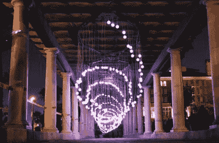

# Syyn 实验室发光的 DNA

> 原文：<https://hackaday.com/2010/10/06/syyn-labs-glowing-dna/>

这个[美妙的音乐同步双螺旋](http://syynlabs.com/component/content/article/45-general/100-glowing-in-santa-monica)是由 Syyn 实验室制造的。上次我们见到他们的时候，他们已经为 OK Go 制作了[那个惊人的鲁布·戈德堡风格的音乐视频。这条 100 英尺长的 LED DNA 链花了超过 1000 个工时来制造。它用了 512 个 LED，32 个 LED 控制器，4 个 Arduinos，4 台电脑，一英里多的电线和一个非常敬业的团队，其中包括 [艾略特菲利普斯](http://hackaday.com/author/eliotphillips/)。它从 beatmatching/VU 软件以及 32 个按钮的控制台或 iPad 接收输入。休息之后，你可以看到一段视频，他们计划在不久的将来发布一段时间的构建。

 <https://www.youtube.com/embed/1yN7RBGrmeY?version=3&rel=1&showsearch=0&showinfo=1&iv_load_policy=1&fs=1&hl=en-US&autohide=2&wmode=transparent>

 </body> </html>