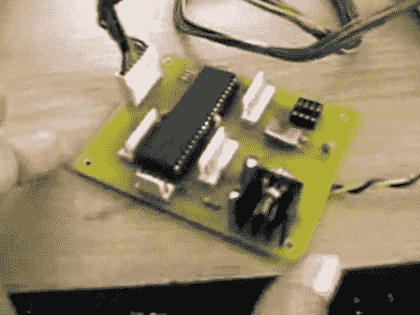

# PIC 可编程电源

> 原文：<https://hackaday.com/2010/10/06/pic-programmable-power-supply/>

这个[可编程电源](http://www.youtube.com/watch?v=zUTZ4zQ2HoA)是你的工作台工具的完美补充。之前[制作了一个全屋电源监控器](http://hackaday.com/2010/07/07/whole-house-current-monitoring/)的【Debraj Deb】，围绕 PIC 18F4520 微控制器设计了这个构建。通过附属键盘设置所需电压，从而在端口 d 的 8 位上产生数字输出。该端口通过 R-2R 数模转换器连接到另一个原型板，从而产生目标电压。一组晶体管放大电流，然后一个功率晶体管负责最终输出。休息过后，您会看到两个视频，第一个视频向我们介绍硬件，第二个视频演示器件的运行，以及对其性能的测量。这无疑提供了比[ATX 电源转换](http://hackaday.com/2009/08/24/bench-power-supply-adapter/)更多的功能。

**更新:**非常感谢【Debraj】发给我们一个代码包以及[测试中使用的原理图](http://hackaday.com/wp-content/uploads/2010/10/prog_power_supply.pdf) (PDF)。我们现在无法下载代码包。稍后再检查，希望我们能尽快完成。

第一部分

 <https://www.youtube.com/embed/d6XO1oouZm8?version=3&rel=1&showsearch=0&showinfo=1&iv_load_policy=1&fs=1&hl=en-US&autohide=2&wmode=transparent>

 
第二部分
 <iframe class="youtube-player" width="800" height="480" src="https://www.youtube.com/embed/zUTZ4zQ2HoA?version=3&amp;rel=1&amp;showsearch=0&amp;showinfo=1&amp;iv_load_policy=1&amp;fs=1&amp;hl=en-US&amp;autohide=2&amp;wmode=transparent" allowfullscreen="true" style="border:0;" sandbox="allow-scripts allow-same-origin allow-popups allow-presentation"/> </body> </html>