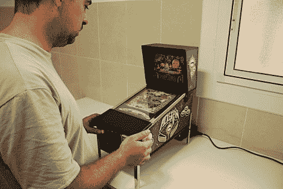

# 迷你弹球是全像素的

> 原文：<https://hackaday.com/2010/10/06/mini-pinball-is-all-pixels/>

你不会在这个[迷你弹球柜](http://www.elotrolado.net/hilo_pocketpin-el-proyecto-veraniego-de-pocket-lucho_1476345)里找到那些熟悉的钢珠。这是因为[路易斯的]最新发明是一种玩虚拟弹球的有趣方式。比赛场地是一个 10 英寸的液晶显示屏，在天棚里还有一个 8 英寸的屏幕。在这个精心制作的盒子里，你会发现一个运行 [HyperPin](http://www.hyperspin-fe.com/forum/forumdisplay.php?f=33) 的迷你 ITX 主板，这是一个基于 LCD 的虚拟弹球的前端软件套件。他还将 [PinMame](http://pinmame.retrogames.com/) 用于计分板，这种计分板通常由新型机械设备上的[气体等离子显示器](http://hackaday.com/2010/08/28/gas-plasma-pinball-display/)提供。休息后有视频，请花点时间查看[Luis'] [其他迷你橱柜构建](http://hackaday.com/2009/09/04/mini-mame-cabinet/)。

你说什么？无法替代真实的东西？[这也正是【本·赫克】所想的](http://hackaday.com/2010/03/17/bill-paxton-pinball/)。

 <https://www.youtube.com/embed/bxPIKYXjX5k?version=3&rel=1&showsearch=0&showinfo=1&iv_load_policy=1&fs=1&hl=en-US&autohide=2&wmode=transparent>

 </body> </html>