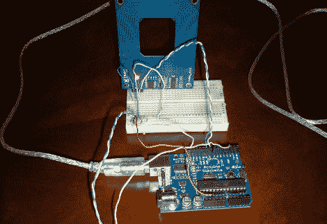

# Arduino，RFID，还有你

> 原文：<https://hackaday.com/2010/10/07/arduino-rfid-and-you/>

【马特】搞混了一批[两个 RFID](http://appdelegateinc.com/blog/2010/10/04/arduino-rfid-security-access/) [读取门锁](http://appdelegateinc.com/blog/2010/10/06/rfid-auth-using-arduino-and-python/)系统。虽然设置的“门锁”部分尚未出现，但“RFID 读取”部分已经启动并运行。通过使用视差 RFID 阅读器([因为便宜，记得吗？一个 Arduino，[Matt]能够解析一个 RFID 标签，在数据库中查找它的号码，然后让一台计算机以一种类似 Python 的“道格拉斯·亚当的滑动门”的方式宣布“拒绝访问”。](http://hackaday.com/2010/05/29/parallax-rfid-reader-for-ten-bucks/)

抛开好书不谈，看一段没有你想象中的那么激动人心的视频吧。

 <https://www.youtube.com/embed/mws0nqkqvGg?version=3&rel=1&showsearch=0&showinfo=1&iv_load_policy=1&fs=1&hl=en-US&autohide=2&wmode=transparent>

 </body> </html>