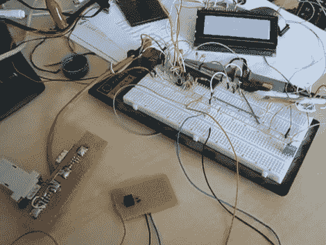

# 用光学传感器弹钢琴

> 原文：<https://hackaday.com/2010/10/07/playing-piano-with-optical-sensors/>

[Sebastian]正在努力提高电子键盘的响应能力。他对击键缺乏足够的敏感度感到不满。他的第一步是测量最快的击键实际有多快。通过设置 LED 和光电晶体管并进行一些测量，他发现 1 kHz 的采样频率就足够了。

随着初步测试的完成，他订购了一些 CNY70 透射/反射光传感器，可以放置在按键下方。他用 ATmega16 微控制器上的 ADC 测量传感器。工作频率为 16 MHz 时，他可以以 1202 Hz 的频率对 8 个模数转换器通道进行采样。在做了大量的数学运算后，他整理了一些查找表，用于将 ADC 数据转换为 midi 信号。我们嵌入了一段视频，视频中有一个传感器控制着 midi 程序 PianoTeq。[Sebastian]还给我们发来了传感器网络中一个节点的示意图(休息后再看)。

一切就绪后，他计划使用 11 个 ATmega16 微控制器来处理 88 个按键，另外一个微控制器作为主机，使用双线接口进行通信。

**更新:**【Sebastian】贴一个网页，描述相当详细。[直接阅读原文](http://sebi.g3th.net/)确实澄清了很多问题。

 <https://www.youtube.com/embed/fUHbq3j0ObE?version=3&rel=1&showsearch=0&showinfo=1&iv_load_policy=1&fs=1&hl=en-US&autohide=2&wmode=transparent>

 

 </body> </html>