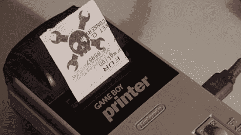

# Game Boy 打印机 USB 电缆和软件

> 原文：<https://hackaday.com/2010/10/08/game-boy-printer-usb-cable-and-software/>

[furtek]将他的[游戏机打印机与个人电脑](http://furrtek.free.fr/index.php?p=crea&a=gbpcable) ( [翻译](http://translate.google.com/translate?js=n&prev=_t&hl=en&ie=UTF-8&layout=2&eotf=1&sl=auto&tl=en&u=http://furrtek.free.fr/index.php%3Fp%3Dcrea%26a%3Dgbpcable))连接起来。这个分为两部分的黑客从一根通过 USB 连接设备的电缆开始。诺基亚接口电缆被用作将 USB 信号转换成串行信号的基础，并且添加了 ATtiny45 微控制器来与打印机对话。他做了一项伟大的工作，自由形成电路改造，并将其安装回塑料 USB 插头外壳。下一步是编写一些软件。他用 VB6 编写了一个应用程序，可以加载图像，缩放图像，并允许你调整热敏打印机产生的对比度。为了测试，他重复使用旧收据。休息之后看看它的实际效果。

 <https://www.youtube.com/embed/EN-63UAD2G4?version=3&rel=1&showsearch=0&showinfo=1&iv_load_policy=1&fs=1&hl=en-US&autohide=2&wmode=transparent>

 </body> </html>