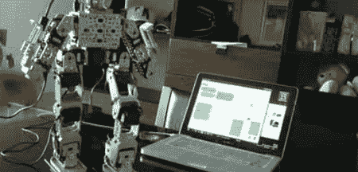

# 学习走路，一个让两足动物行走的教程

> 原文：<https://hackaday.com/2010/10/11/learning-to-walk-a-tutorial-on-making-bipeds-walk/>

[Robert Lam]制作了许多视频教程，他最近的一个教程是关于如何让一个双足机器人行走的教程。他主要讲述个人的动作和行为。他没有深入任何具体的编程，而是将行走分解成几个动作，并讨论了你需要它们的原因以及一些变化。对于一些人来说，这似乎是显而易见的观察结果，但我们已经看到许多双足机器人试图在不转移体重的情况下行走。你可以在休息后观看这个视频，但一定要在他的[其他教程](http://www.youtube.com/user/robertlam18)中挖掘大量的好东西。

 <https://www.youtube.com/embed/Xhz6m6fu494?version=3&rel=1&showsearch=0&showinfo=1&iv_load_policy=1&fs=1&hl=en-US&autohide=2&wmode=transparent>

 </body> </html>