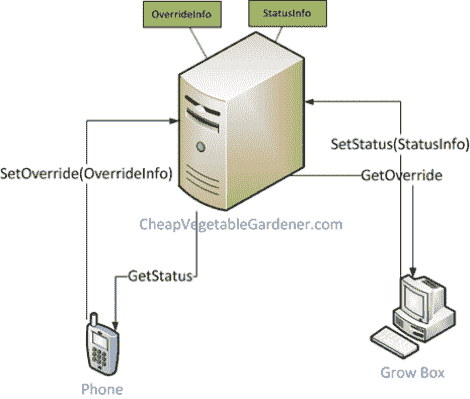

# 给你的园艺增加移动控制

> 原文：<https://hackaday.com/2010/10/11/adding-mobile-control-to-your-gardening/>

[廉价的蔬菜园丁]想从路上查看他的花园，所以他为他的 WinPhone 写了一个控制应用程序。硬件工作已经完成；已经[建造和测试](http://hackaday.com/2009/09/15/grow-box-controls-heater-fans-and-water/)很长一段时间了。

实现分为两部分，如上图所示。种植箱在防火墙后面，因为你不希望人们心血来潮打开水和种植灯。界面的第一部分通过在主机上提供一组功能来处理这种分离。第二部分是手机应用程序本身，它调用这些功能并显示所有相关信息，从灯、加热器、排气和水泵的状态到当前的温度和湿度。他甚至用谷歌图表来绘制一段时间内的数据。在没有任何经验的情况下，该应用程序本身花了大约两个小时来编写代码，这证明了这些工具正在获得的可接近性水平。