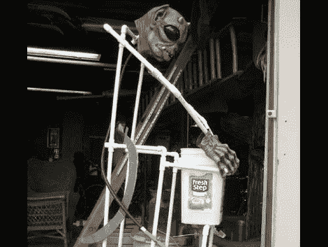

# 万圣节道具:呕吐的海盗

> 原文：<https://hackaday.com/2010/10/12/halloween-props-puking-pirate/>

随着每个人最喜欢的免费糖果节日的临近，[Slouriesr]开始为他的万圣节展示建造一个呕吐的食尸鬼。他称之为呕吐的海盗，它围绕着一个泵和一些简单的管道设备。

首先，呕吐容器是通过在猫砂桶的底部添加一个带有弹出式塞子的水槽排水管制成的。排水管减缓了液体排入下面一个 5 加仑的桶中的速度。在那个桶里，你会发现一个浮动开关泵，用来防止水进入水池盖。当水桶装满时，水泵打开，通过一根软管将水倒空，软管的末端是食尸鬼的嘴。结果是一个 20 秒的呕吐周期，肯定会让“不给糖就捣蛋”的人高兴。当然，要让这个家伙看起来像个角色还有很多工作要做，但是这是个多么棒的主意啊！

请发送您最新道具制作的详细信息,让我们沉浸在节日气氛中。