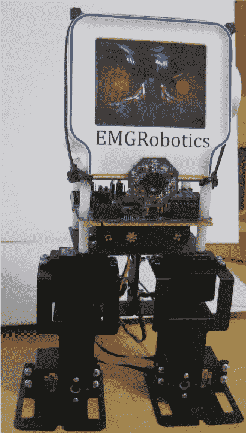

# 查姆比迈出了第一步

> 原文：<https://hackaday.com/2010/10/13/chumby-takes-its-first-steps/>

[埃里克·格雷戈里]对查姆比有点疯狂，把它变成了一个双足机器人。我们预料到了各种各样很酷的 [chumby](http://www.chumby.com/) 黑客行为，但我们不能说我们预见到了这一点。[Eric]指出，凭借 454Mhz 处理器、64MB 内存、2GB 可扩展存储和 USB 主机端口，Chumby 完全可以作为机器人平台。随着一个神秘的即将公布的传感器板的加入，他使这个 chumby 变成了一个行走的两足动物。虽然任何可以为 linux 编写程序，甚至编写 flash 应用程序的人都可以为 chumby 编写软件，但[Eric]选择移植[机器人视觉工具包](http://www.emgrobotics.com/)。这为那些能用 Basic 语言写作或为 C64 或 Apple 写过东西的人打开了大门。休息之后你可以看到这个家伙的视频。

[https://www.youtube.com/embed/uBMvGDectjk?version=3&rel=1&showsearch=0&showinfo=1&iv_load_policy=1&fs=1&hl=en-US&autohide=2&wmode=transparent](https://www.youtube.com/embed/uBMvGDectjk?version=3&rel=1&showsearch=0&showinfo=1&iv_load_policy=1&fs=1&hl=en-US&autohide=2&wmode=transparent)

[via [邦尼的博客](http://www.bunniestudios.com/blog/?p=1338)