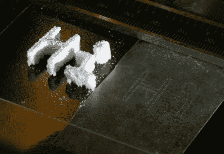

# DIY 打印头实验

> 原文：<https://hackaday.com/2010/10/13/diy-print-head-experiments/>

喷墨打印头在家庭作坊里很少见。我们希望看到更多，当我们看到这个[单喷嘴，按需滴，头部正在建造](http://www.andaquartergetsyoucoffee.com/wp/?p=220)时，我们真的很兴奋。使用压电盘作为廉价的蜂鸣器和一些 reprap 魔法，[Johnrpm]得到了一些结果。[Madscifi]一直在完善喷嘴的设计，两人与我们分享了这一过程。由于它可以滴下一滴液体，因此它可以以多种方式使用，例如滴下普通的旧无聊墨水，或者将溶剂滴进一些 3d 打印的粉末中。你可以在上面看到一个糖 3d 打印的例子。

[via [Makezine](http://blog.makezine.com/archive/2010/10/printing_in_sugar_with_a_diy_inkjet.html)