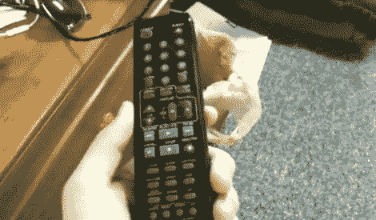

# 电视遥控器的寻呼系统

> 原文：<https://hackaday.com/2010/10/13/paging-system-for-your-tv-remote/>

[Matt]将电视遥控器和无绳电话组合在一起，为遥控器添加一个定位系统。无绳电话的最大特点之一是底部的传呼机按钮。当你按下它时，听筒发出哔哔声，直到找到为止。马特取出了一个，去掉了不必要的部分。然后，他打开电视遥控器的外壳，插入电话听筒的电路板、扬声器和电池。基站就像平常一样被用来定位电话/遥控器组合，并被修改为使用充电电缆来补充电话电池，为新入侵的单元中的一切供电。[Matt 的]演示视频在休息后嵌入。

他扔掉了麦克风，真是太糟糕了。用这个打电话会很有趣。

 <https://www.youtube.com/embed/9Xb57M-KpII?version=3&rel=1&showsearch=0&showinfo=1&iv_load_policy=1&fs=1&hl=en-US&autohide=2&wmode=transparent>

 </body> </html>