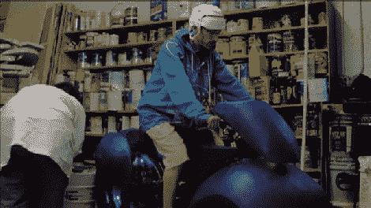

# 泵站:一个接管机器

> 原文：<https://hackaday.com/2010/10/14/pumping-station-one-takes-on-the-machine/>

黑客空间泵站第一部和[第二部](http://thetransistor.com/2010/10/take-on-the-machine-pumping-station-one-part-2/):一个接受司祭盎挑战的已经准备好了，等待你的观赏。泵站的团队:一个人建造了一辆 Tron 主题自行车，如果安装得当，它会用干冰和乙醇在大约 6 分钟内搅拌冰淇淋，让你的尿液变成氖气。除了听起来不那么好吃，而且一路上有许多问题之外，这个项目证明是成功的。问题变成了，它经得起最后一个黑客空间 NYC Resistor 的考验吗，他制造了一个[饮料混合老虎机](http://hackaday.com/2010/10/07/nyc-resistor-takes-on-the-machine/)？这两者将如何公平地对抗碰撞空间的音乐建筑？

[谢谢德文]