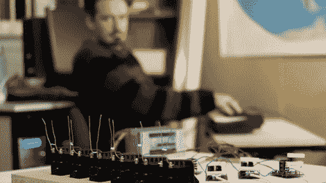

# 聚质拱音

> 原文：<https://hackaday.com/2010/10/16/they-polyplasmic-archophone/>

[聚等离子弧音器](http://wiki.artifactory.org.au/doku.php?id=projects:arcophone)是高压[电弧音乐](http://hackaday.com/2010/05/23/spark-plug-music/)的一种新方法。他们正在使用 Arduino 克隆来转换点火线圈的信号。还没完成，但是效果还过得去。最后，它将有两层音圈，总共 13 层。他们用不同的材料做天线，这样他们可以得到不同颜色的火花。休息后你可以看到它的视频，我们必须说效果非常好。改变视频的灯光，我们可以想象这是一部电影的场景。

 <https://www.youtube.com/embed/_WfszpzNAmw?version=3&rel=1&showsearch=0&showinfo=1&iv_load_policy=1&fs=1&hl=en-US&autohide=2&wmode=transparent>

 
[via <a href="http://blog.makezine.com/archive/2010/10/polyplasmic_arcophone.html" target="_blank"> Makezine </a>
 </body> </html>