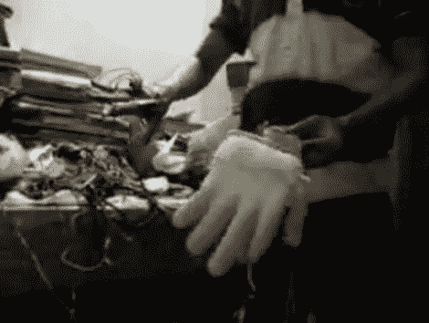

# 手势控制机器人手

> 原文：<https://hackaday.com/2010/10/17/gesture-controlled-robotic-hand/>

受电影《阿凡达》中 AMP 套装控制系统的启发，[Feelpavan]建造了这个[手势控制的机器人手](http://feelpavan.wordpress.com/2010/10/14/robotic-hand-using-gesture-recogntion/)。到目前为止，手腕有旋转和弯曲的功能，手指也有弯曲的功能(但不是单独的)。这是由手组件上的三个伺服电机完成的。通过使用加速度计和他自己建造的 Arduino，手的指令是从你自己的手中收集的。休息之后来看看。

[https://www.youtube.com/embed/sMBTIPqh6D4?version=3&rel=1&showsearch=0&showinfo=1&iv_load_policy=1&fs=1&hl=en-US&autohide=2&wmode=transparent](https://www.youtube.com/embed/sMBTIPqh6D4?version=3&rel=1&showsearch=0&showinfo=1&iv_load_policy=1&fs=1&hl=en-US&autohide=2&wmode=transparent)