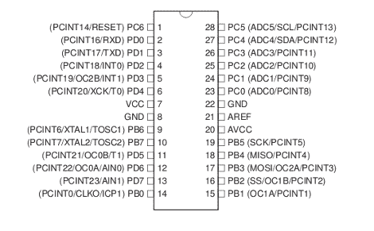

# AVR 编程 01:简介

> 原文：<https://hackaday.com/2010/10/23/avr-programming-introduction/>

我们喜欢看硬核电子项目，它有一个结实的微控制器，中心有数百行代码，如果不是数千行的话。但是每个人都需要以某种方式到达那里。

本系列教程旨在让你轻松编写微控制器的 [Atmel](http://www.atmel.com/products/AVR/) [AVR 系列。无论你以前从未接触过微控制器，还是你已经接触了几十个 Arduino 项目，这将帮助你直接进入硬件，并给你信心去构建任何东西。](http://www.atmel.com/products/AVR/)

**系列路线图:**

*   [AVR 编程 01:简介](http://hackaday.com/2010/10/23/avr-programming-introduction/ "Permanent Link to AVR Programming 01: Introduction")
*   [AVR 编程 02:硬件](http://hackaday.com/2010/10/25/avr-programming-02-the-hardware/ "Permanent Link to AVR Programming 02: The Hardware")
*   [AVR 编程 03:读取和编译代码](http://hackaday.com/2010/11/05/avr-programming-03-reading-and-compiling-code/ "Permanent Link to AVR Programming 03: Reading and compiling code")
*   [AVR 编程 04:写代码](http://hackaday.com/2010/11/19/avr-programming-04-writing-code-etc/)

**必备知识**

好消息是:我把门槛设得很低。你需要在电脑上安装程序并使用它们的基本知识。你应该对[无焊试验板如何工作](http://en.wikipedia.org/wiki/Breadboard#Bus_and_terminal_strips)有所了解，最好你有一个万用表，知道如何用它来测量电压。你不应该害怕使用谷歌来研究这里没有明确回答的问题。

微控制器实际上是做什么的？

这是一个有内涵的问题。为了便于理解，我将把它简化为最简单的解释:

1.  微控制器接受某种类型的输入
2.  它会根据你写的软件做出决定
3.  基于步骤 2 中的决定改变输出。

微控制器做你编程让它做的事情。它做得又快又可靠。

它是如何工作的？

在这个系列教程中，我将讨论数字逻辑。也就是说，所有输入和输出引脚将基于零电压或 5V 电压进行判断。这就产生了我们的数字 1 和 0，5 伏为 1，0 伏为 0。

因此，如果你想点亮一个 LED，只需将电路连接到一个引脚，使该引脚成为输出，并将其设置为逻辑高电平(5 伏)。如果您想添加一个按钮，将其连接到一个设置为输入的引脚，并对芯片进行编程，以测量该引脚的电压电平。一旦你学会了如何写正确的命令，芯片就能理解你的愿望，这真的很简单。

**一看芯片本身**

我决定用 ATmega168 微控制器。这是一种功能强大的芯片，但使用起来并不比它的年轻兄弟们更难。这将为你的项目留下足够的发展空间，同时保持可承受的价格(低于 4.50 美元)。这是它的示意图:



这通常被称为引脚排列，因为它显示了芯片上 28 个引脚的实际用途。所有这些别针都有多种功能，这就是为什么除了只有一个名字的五个以外，每个旁边都有一长串文字。这些是与电压和地有关的引脚(VCC、GND、AVCC、AREF、AGND)，这是微控制器的一个重要问题。

集成电路需要稳定的电压源。这意味着作为我们项目的一部分，我们需要建立一个电压调节器。这在试验板上很容易做到，您应该能够在本地接触到这些器件。另外值得注意的是，芯片顶部有一个半圆形的凹痕。这是你会在这些双列直插式封装芯片的塑料外壳中找到的东西，用来确保你不会把它插反。

再次查看引脚排列，寻找名称以 PD 开头的引脚。您应该看到总共有八个，标记为 PD0 到 PD 7。这是这些芯片的 8 位特性的一个极好的例子。PD 代表端口 D，输入和输出寄存器之一。 ***这些芯片中的一切都以 8 位为中心。*** 那是八个 1 或 0 不同组合的序列。如果您想打开或关闭特定的功能，您可以更改 8 位寄存器中的一个或多个位。每次您想要更改一个 pin 时，您必须对寄存器中的所有八个进行寻址。我们将了解更多这方面的内容，但要等到本系列的第三部分。

**编程**

ATmega168 是一款可编程微控制器。但更好的是，它是可重新编程的。事实上，当你在做一个项目时，你很可能一个小时就要重新编程几次。

该芯片的编程空间大小限制为 16 千字节。在 64 千兆字节 iPods 的现代时代，16 千字节可能听起来微不足道。但实际上那是 16 千字节的机器代码。你可以用它做很多事情…相信我。

你确实需要某种硬件来把代码放到这些芯片上。通常这是以 AVR 程序员的形式出现的。在本教程的第二部分，我们将看看几种不同的编程选项，然后构建和编程一个测试电路。

## 做家庭作业

为了准备这个系列教程的剩余部分，我需要你收集一些工具。你必须有某种类型的计算机，可以是 Linux box、Mac 或 Windows PC。这将运行软件，获取我们的代码，将其编译成微控制器可以使用的东西，然后告诉程序员如何将其写入我们的芯片。

**编译器**

我们最终将为 AVR 编写自己的代码，它使用 RISC 架构。但是我们是在 x86 架构的电脑上做的。完成这个任务的必要工具叫做[交叉编译器](http://en.wikipedia.org/wiki/Cross_compiler)。这很可能是选择 AVR 进行开发的最好理由，有一个很好的工具链可以很容易地安装在多个平台上。

*   Mac 用户:安装[交叉包](http://www.obdev.at/products/crosspack/download-de.html)
*   Windows 用户:安装 [WinAVR](http://sourceforge.net/projects/winavr/)
*   Linux 用户:Debian 和 Ubuntu 用户应该安装包含整个工具链的 GCC-AVR 包。其他人可能想看看 [AVR-libc 工具链页面](http://www.nongnu.org/avr-libc/user-manual/overview.html)来帮助编译这些包。

这不是唯一的选择。很多 Windows 用户对 [Atmel 的免费 AVR Studio 软件](http://www.atmel.com/dyn/products/tools_card.asp?tool_id=2725)信誓旦旦。这是我唯一一次引用它，因为我没有 Windows 系统的机器，也从未尝试过这个包。

**编程软件**

我们用来运行硬件编程器的软件叫做 AVRdude。如果你安装了上面的工具链，你应该已经有了这个程序。转到终端窗口或命令提示符，键入以下命令以确保:

```
avrdude -h
```

这将显示帮助屏幕。如果出现错误，您应该检查以确保您在前面的步骤中正确安装了工具链，[或者自己去下载 AVR dude](http://savannah.nongnu.org/projects/avrdude/)。

## 未来会怎样

这就结束了本系列的介绍部分。

**[第二部分](http://hackaday.com/2010/10/25/avr-programming-02-the-hardware/) :** 在本系列的下一期文章中，我们将看看可以用来对 AVR 微控制器进行编程的几款硬件。我写了一个 [hello world](http://en.wikipedia.org/wiki/Hello_world_program) 程序，将带你在试验板上构建电路，将芯片连接到编程器，并使用 AVRdude 将这个简单的固件写入设备。我不想让你太兴奋，但这确实涉及到一个闪烁的 LED。

**[第 3 部分](http://hackaday.com/2010/11/05/avr-programming-03-reading-and-compiling-code/) :** 在本系列的第 2 部分中，一个预编译的十六进制文件用于对 AVR 微控制器进行编程。在这一部分，我们将看看组成固件的 C 语言源代码。我还将深入讨论芯片上可用的外设，并详细说明如何使用它们。我们将通过向原始程序添加功能，重新编译它，并用升级版本对芯片重新编程来结束。

**[第四部分](http://hackaday.com/2010/11/19/avr-programming-04-writing-code-etc/) :** 现在你已经掌握了 AVR 编程技巧，我将向你展示如何开始用它们构建很酷的东西。

## 跟随我: