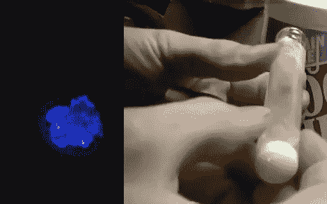

# 更多 EL 化学:发光墨水

> 原文：<https://hackaday.com/2010/10/19/more-el-chemistry-luminescent-ink/>

[Jeri Ellsworth]继续她的电致发光实验，这次她正在制作 EL 墨水。她要找的墨水是硫酸锌溶液。她选择的方法是重新掺杂一些辉光粉末，这样它就可以被交流电周围的电场激发。在她的视频(在休息后嵌入)中，她通过详细描述锌和硫原子的立方晶格以及添加的铜原子(添加该原子是一个称为掺杂的过程)来谈论她所追求的化学性质。

实验的快速和肮脏的概要从用洗碗皂洗涤发光粉末以获得硫化锌晶体开始。然后，她将现代硬币内部的硫酸铜和锌屑混合，产生悬浮在溶液中的铜金属和硫酸锌。这是混合了硫化锌从辉光粉末洗涤和掺杂多一点硫酸铜。将多余的液体倒掉，用玻璃粉盖住试管，整个东西撞上窑炉开始反应。当交流电激发时，结果会发光，但如果在混合物中加入氯原子，效果会更好。

每次看到杰里的新化学技术，我们都很兴奋。我们希望看到更多，所以如果你在互联网旅行中遇到有趣的化学实验，[请让我们知道它们](http://hackaday.com/contact-hack-a-day/)。只要确保你在处理化学品时对自己在做什么有所了解…安全第一。

[https://www.youtube.com/embed/pmQqdYrn9g8?version=3&rel=1&showsearch=0&showinfo=1&iv_load_policy=1&fs=1&hl=en-US&autohide=2&wmode=transparent](https://www.youtube.com/embed/pmQqdYrn9g8?version=3&rel=1&showsearch=0&showinfo=1&iv_load_policy=1&fs=1&hl=en-US&autohide=2&wmode=transparent)