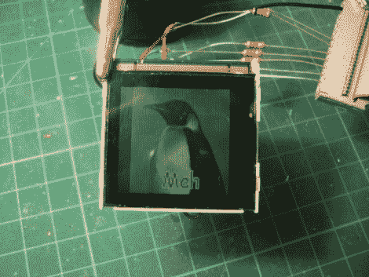

# 使用手机 LCD 作为 Linux 的辅助显示器

> 原文：<https://hackaday.com/2010/10/19/using-a-cellphone-lcd-as-auxiliary-linux-display/>

[Neil]正在使用他的 Linux 机器上的并行端口驱动这台西门子 A60 LCD。他喜欢这个模块，因为它有一个集成的 LED 背光，控制器 IC，焊盘足够大，可以让人焊接。他注意到屏幕运行在 2.9V，这与用作背光的 led 的正向电压相匹配。这意味着可以使用一个 led 作为分流器，将输入电压降至控制器的安全水平。事实上，他就是这么做的。数据线与一些限流电阻一起连接到并行端口。LED 与为最大亮度计算的电阻器连接，LED 的输出用作 LCD 控制器芯片的源电压。无论你是想在个人电脑上使用这些屏幕，还是想使用其他屏幕,[Neil]编写的代码应该能提供这样做所需的信息。

诺基亚的手机 LCD 帖子启发了【尼尔】提交了一份关于这个项目的建议。如果你有记录在案的黑客，为什么不[让我们知道呢](http://hackaday.com/contact-hack-a-day/)？