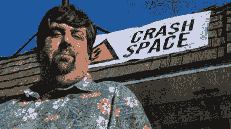

# 碰撞空间占据了机器

> 原文：<https://hackaday.com/2010/10/21/crash-space-takes-on-the-machine/>

又到时间了，是时候用黑客空间、[坠毁空间](http://thetransistor.com/2010/10/take-on-the-machine-crash-space-part-1/)(和[第二部](http://thetransistor.com/2010/10/take-on-the-machine-crash-space-part-2/))来挑战这台机器了！加州团队出发了，并成功地将他们的建筑正面变成了一件乐器，类似于【大卫·拜恩】[演奏建筑](http://hackaday.com/2008/06/10/bbtv-playing-the-building/)。当一个行人走过时，他们会触发距离传感器，进而驱动木槌敲击特定的物体发出声音。我们对这个装置的互动性感到惊喜，尽管听起来不是很好。但这足以击败前两支队伍吗？而它将如何对付匠人们庇护的 [而不是你所想的](http://www.yourdailymedia.com/media/1136233379) 早餐机下次呢？

[谢谢德文]