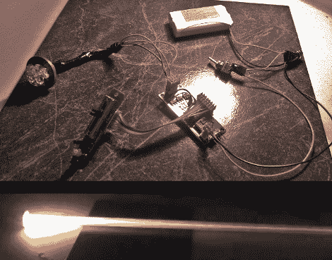

# 光剑颜色选择器

> 原文：<https://hackaday.com/2010/10/24/lightsaber-color-selector/>

[乔治·哈德利]开发了一个很好的设置来控制复制光剑的颜色。一块小型 PCB 内置 PIC 18F2221 和三个颜色开关晶体管。手柄顶端有一个强大的 LED，照亮组成刀片的扩散器。但我们最喜欢的部分是控制方案。他在手柄中嵌入了一个小型 RGB LED，可以反馈当前可以调整的光的颜色(红色、绿色或蓝色)。一个按钮滚动颜色，一个滑动电位计调节颜色。

我们不会称之为万圣节道具，我们认为它更适合[严肃的复制品](http://hackaday.com/2010/08/27/devote-your-life-to-replicating-a-lightsaber/)。但它会给小家伙的服装增加一个惊人的亮点。休息之后看看它的实际效果。

 <https://www.youtube.com/embed/POjmL48CssU?version=3&rel=1&showsearch=0&showinfo=1&iv_load_policy=1&fs=1&hl=en-US&autohide=2&wmode=transparent>

 </body> </html>