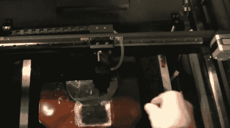

# 激光切割机的气体密封

> 原文：<https://hackaday.com/2010/10/25/gas-containment-for-laser-cutters/>

厌倦了呼吸你的激光切割机放出的有毒气体？是啊…我们也没有激光切割机。但是[Jeri Ellsworth]需要，她需要一种方法来排出切割过程中产生的废气，这样它们就不会损坏激光切割机或她的肺部。她想出的是一个与泵系统相连的密封盒。

问题是，你想让气体远离激光切割机硬件，但你仍然需要能够向你的工作材料发射激光。她聪明的解决办法是使用一种硅晶片，就像她用来制作集成电路的那种。它们允许红外激光穿过而不会被劈成两半。你在上面的图像中看到的是一个红色的盒子，中间是圆形的晶片。靠近图像底部是一个清晰的窗口，这样你就可以看到你的工件正在进行什么。但是为了获得完整的想法，你需要在休息之后观看嵌入的视频。

我们不禁认为她建造这个是为了准备更多的化学黑客攻击。

[https://www.youtube.com/embed/eGJ2WZRdUPA?version=3&rel=1&showsearch=0&showinfo=1&iv_load_policy=1&fs=1&hl=en-US&autohide=2&wmode=transparent](https://www.youtube.com/embed/eGJ2WZRdUPA?version=3&rel=1&showsearch=0&showinfo=1&iv_load_policy=1&fs=1&hl=en-US&autohide=2&wmode=transparent)