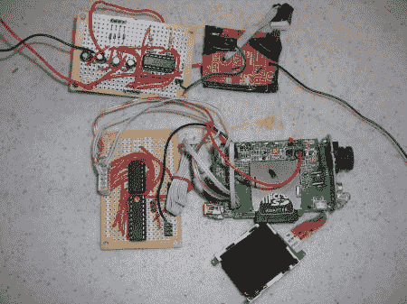
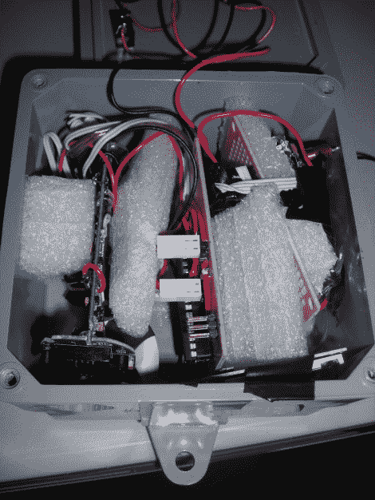
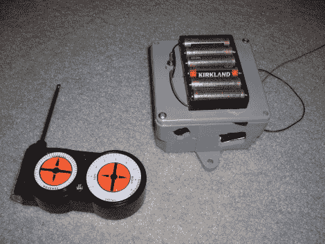

# 遥控摄像机拍摄啮齿动物的亲密视频

> 原文：<https://hackaday.com/2010/10/25/rc-controlled-camera-takes-intimate-video-of-rodents/>

[Leor]想在他的院子里拍一些野生动物的视频，像这只花栗鼠或一些蜂鸟，但每次他试图靠近它都会把它们吓跑。他的解决方案是[安装一台便宜的录像机，由无线电控制](http://www.mediafire.com/?3ecvojgpvw41j0z)。捐赠相机是基于易贝购买的廉价 SD 卡，可拍摄 720×480 视频。[Leor]从记录仪的 PCB 上拆下 SMD 开关，并在其位置上连接一个 4066 四路双向开关 IC。一辆遥控玩具汽车捐赠了一对接收器和发射器。接收器信号由 AVR 微控制器监控，该微控制器将命令转换为一组适当的视频按钮按键。你得到的是一个控制器，可以打开相机，设置到合适的模式，以及开始和停止录制的能力。

休息过后，我们得到了一些硬件的照片，并且[Leor]发布了[一小段花栗鼠视频](http://www.dropshots.com/nobody102#date/2008-01-01/12:07:18)供你们欣赏。

组件板(点击放大):

外壳内部:

成品:

