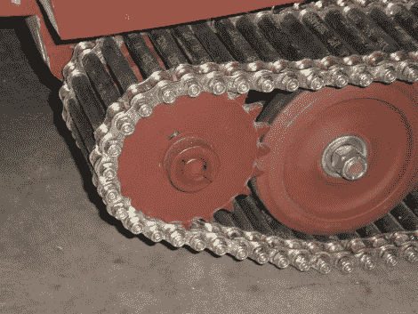

# 下一个机器人的坦克履带

> 原文：<https://hackaday.com/2010/10/26/tanks-treads-for-your-next-robot/>

如果你曾经想把坦克履带融入到你的建造中[，你应该看看这个指南](http://www.rctankcombat.com/articles/track-systems/)。上面显示的方法是我们最喜欢的，它使用橡胶燃油管和#10 机器螺栓将两段空心销滚子链固定在一起。你可以看到驱动链轮是键入链条的外部长度，但分配车辆重量的车轮靠在橡胶管上。您还可以找到关于构建铰链轨道、模压轨道、塑料传送带轨道、跑步机轨道和自行车链条结构的详细信息。当你最终开始制作那个[彩弹罐](http://hackaday.com/2010/08/31/wearable-controller-for-your-paintball-tank/)时，这会减少开发时间。

[感谢博库]