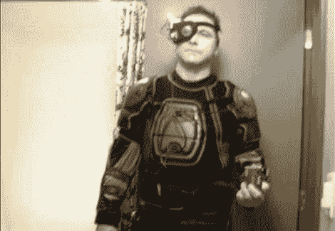

# 万圣节道具:博格人服装

> 原文：<https://hackaday.com/2010/10/27/halloween-props-borg-costume/>

今年晚些时候，万圣节服装蜂拥而至，但我们很高兴看到[DJ Sures]及时完成了他的博格人服装。它由来自不同文化的物品大杂烩组成…哦，等等，博格人也是。其中包括一套喷成黑色的曲棍球垫，只涂了一层淡淡的银雾，给它们一些深度。在拍摄了上面的图片(主要展示了他的化妆)后，[DJ Sures]在胸板上增加了一个 LCD 屏幕，并在整个过程中点亮了电子设备。休息之后自己看吧。

如果你喜欢这个，你可以看看他的[唱歌火花塞](http://hackaday.com/2010/05/23/spark-plug-music/)。

[https://www.youtube.com/embed/exbADVDdfKw?version=3&rel=1&showsearch=0&showinfo=1&iv_load_policy=1&fs=1&hl=en-US&autohide=2&wmode=transparent](https://www.youtube.com/embed/exbADVDdfKw?version=3&rel=1&showsearch=0&showinfo=1&iv_load_policy=1&fs=1&hl=en-US&autohide=2&wmode=transparent)