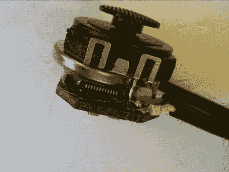

# 史上最小的游戏机。永远不会。

> 原文：<https://hackaday.com/2010/10/27/smallest-gaming-console-ever-ever/>

就是它…控制器[和视频游戏系统](http://rossum.posterous.com/building-the-rbox)合二为一。这是[Rossum's]的独立版本。[我们在 6 月份参观了原型机](http://hackaday.com/2010/06/13/gaming-system-for-less-than-three-bucks/)，但那是使用了一个笨重的开发板。你可以看到夹在操纵杆和主板之间的 CR1632 纽扣电池，它可以为设备供电约四个小时。右图中的电缆用于通过 RCA 连接器将单声道音频和视频连接到电视。没有可互换盒式磁带的端口，这意味着所有的游戏数据都必须编程到 ARM Cortex M0 处理器中。休息之后看[Rossum 的]演示视频。

[https://www.youtube.com/embed/r-Mdt6uzmOg?version=3&rel=1&showsearch=0&showinfo=1&iv_load_policy=1&fs=1&hl=en-US&autohide=2&wmode=transparent](https://www.youtube.com/embed/r-Mdt6uzmOg?version=3&rel=1&showsearch=0&showinfo=1&iv_load_policy=1&fs=1&hl=en-US&autohide=2&wmode=transparent)