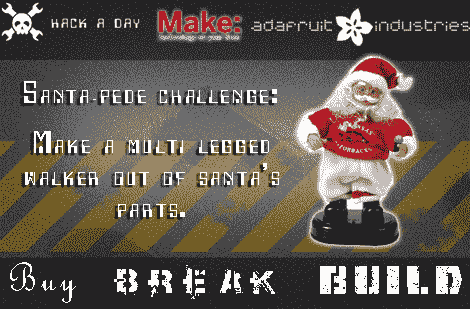

# BBB #1:圣诞老人的挑战

> 原文：<https://hackaday.com/2010/10/29/bbb-1-the-santa-pede-challenge/>

欢迎来到由 [Adafruit Industries](http://www.adafruit.com) 和 [Make](http://www.makezine.com) 主办的 hackaday 第一届 [Buy Break Build](http://hackaday.com/2010/10/28/buy-break-build-a-hackaday-contest-series/) 。这个挑战将集中在跳舞的圣诞老人，或者他们的内心。我们到处都能看到它们，甚至可能在某个地方的阁楼里有一两个。这些烦人的小家伙应该有足够的内部零件来构建一些非常有趣的东西。这一次，我们希望看到一种多足行走装置。我们不在乎它有 2 条腿、7 条腿还是 32 条腿，只要它能用腿“行走”。

在打破规则、公布奖项之后，请加入我们，看看谁将是特邀评委！

**挑战:**
获得一个[跳舞的圣诞老人](http://www.youtube.com/watch?v=ycGiO1AVdIg)。我们不在乎它是哪一个，你花了多少钱，它有多大等等。我们知道有很多模型，从跳舞的圣诞老人(荷马·辛普森)到真人大小的巨型圣诞老人。这可能是一个好主意，先做一些专利搜索，弄清楚里面是什么。这里有一个你能找到的例子( [pdf](http://www.freepatentsonline.com/6071170.pdf) )。

把圣诞老人拆开，用这些碎片做一个多足行走的东西。有[吨](http://hackaday.com/2010/08/10/super-simple-inch-worm-mechanism/)的方法[来完成这个](http://hackaday.com/2010/03/24/theo-jansen-like-the-professor-from-gilligan/)。尽量只使用圣诞老人送来的碎片。你可以添加胶带/胶水和焊料(以及电池)。我们意识到，你可能绝对需要添加一些东西来让你的计划发挥作用。请准确记录您添加的内容，因为这将是评判点之一。

拍摄并记录整个过程，并在**11 月 30 日**之前[提交给我们](mailto:bbb@hackaday.com)。

评判:
你的参赛作品将由 Hackaday 的工作人员以及我们的嘉宾评委【Phillip Torrone】进行评判。对于那些不熟悉的人来说，[【菲利普】是 Hackaday](http://hackaday.com/author/philliptorrone/) 的创始人。评判将基于最终结果、演示文稿、使用了多少外部零件以及文档记录的好坏。

将选出三名优胜者，他们各有所长。

*最好的结果:*这个项目将使用最少的外部零件来提高效率。在这个问题上，我们更注重功能而不是形式。

最佳展示:你的步行机看起来会很棒。你的剪裁很流畅，你的动作很流畅，你的照片很讨人喜欢…也许它做得不是很好，但是看起来很棒。

最过分的是:所以你决定安装一台 6hp Briggs 和 Stratton 发动机，而不是遵守规则，你设法让它实际工作。那是什么？你还编程让它取回冰冻饮料？太棒了。为此我们会给你一个奖励。

**奖品:**
Santa-pede 挑战赛的奖品由 [Adafruit Industries](http://www.adafruit.com) 提供，具体如下。

最佳结果:[最小助力](http://www.adafruit.com/index.php?main_page=product_info&cPath=10&products_id=14)。Mintyboost 是一款适用于移动设备的电池充电器。只需将 2 节 AA 电池放入漂亮的 altoids 铁盒中，就可以开始充电了。

最佳演讲奖:[抽签](http://www.adafruit.com/index.php?main_page=product_info&cPath=28&products_id=197)。一种特殊的工具，根据你所附着的书写工具的运动来发出声音。

最矫枉过正:[脑机](http://www.adafruit.com/index.php?main_page=product_info&cPath=48&products_id=287)。一副向你的眼睛发射脉冲光的眼镜。据称，它可以通过同步脑电波让你进入冥想状态。我们只是觉得它们看起来很酷。

我们还将从以上三位中选出一位，赢得由[makershed.com](http://makershed.com/)赠送的《Make》杂志首年套装一盒。这个决定大部分是基于一时兴起，但可能会给在不止一个领域做得最好的人。

**FAQ:**——这个会随着人随着问题更新。这是我们的第一次，所以会有一些—

*   我可以输入多少次？
    想进多少次就进多少次。我们不介意。

*   我能熔化塑料来完全改变形状吗？
    绝对。听起来棒极了。

*   我应该向你提交什么，pdf？一个网站？
    我们对你给我们的东西相当开放。最终，我们想把你的文章发布在 hackaday 上，这样 pdf 或 word 文档就可以了。不过，我们不会拒绝其他格式。尽管保留那些原始的照片。如果我们重新发布您的文档，我们不想将它们从文档中删除！