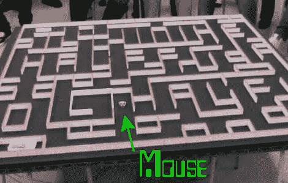

# 迷宫解决机器鼠

> 原文：<https://hackaday.com/2010/10/29/maze-solving-robo-mouse/>

寻找一种既有挑战性又让外行人感兴趣的东西？从这个[迷宫解决机器人鼠标](http://www.botjunkie.com/2010/10/28/micromouse-solves-maze-in-5-seconds-flat/)中获得一些灵感。它采用了循线机器人的概念，并使它变得更加酷。微型漫游车使用传感器绘制出一个物理迷宫。一旦它想通了，你就把它放回起点，加速跑到终点。我们在下面嵌入了展示整个过程的视频。看起来速度跑只用了不到五秒钟就完成了。

既然你已经在真实的迷宫中享受了一只虚拟的老鼠，那就来看看[一只真实的老鼠在虚拟的迷宫中](http://hackaday.com/2009/10/16/mouse-runs-through-vr-maze/)。

[https://www.youtube.com/embed/FzBwnsnxFGU?version=3&rel=1&showsearch=0&showinfo=1&iv_load_policy=1&fs=1&hl=en-US&autohide=2&wmode=transparent](https://www.youtube.com/embed/FzBwnsnxFGU?version=3&rel=1&showsearch=0&showinfo=1&iv_load_policy=1&fs=1&hl=en-US&autohide=2&wmode=transparent)

[非常感谢]