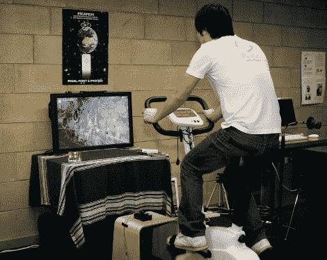

# 沿着谷歌街景锻炼

> 原文：<https://hackaday.com/2010/10/29/exercise-along-to-google-street-view/>

作为硕士论文的一部分【Lette Moloney】[做了这个健身车控制谷歌街景](http://lettesblog.wordpress.com/2010/10/28/escapism-pedal-through-google-streetview-on-a-stationary-bike/)。硬件设置非常简单，两个相邻安装的霍尔效应传感器检测热粘在曲柄上的磁铁。当磁铁经过传感器时，Arduino 会根据哪个传感器先被触发来确定是向前还是向后移动。从那里一个按键被发送到[谷歌街景](http://maps.google.com/help/maps/streetview/)相应地移动虚拟位置。

有一点是我们看到视频(休息后嵌入)才想到的，穿越街景并不是一个流畅的体验。它更像是你锻炼时的幻灯片。没什么大不了的，因为硬件设置可以重复使用不同的虚拟刺激。我想到的一件事是在你的自行车车把上安装一个摄像头，记录下你在温暖的月份里最喜欢的骑行，这样你就可以在室内冬季训练时重放它们。当然，这将需要一些编码来将 Arduino 数据与视频播放速度结合起来，但我们无论如何都希望看到它完成。哇，想象一下这样一个数据库，它将允许人们分享他们乘坐的视点视频…这是我们了解攀登的感觉的唯一方式。

不久前，我们看到了许多这样的固定自行车黑客。如果这满足了你的胃口，那就去看看[一个带可穿戴显示器的](http://hackaday.com/2009/11/19/another-stationary-bike-vr-rig/)，另一个[也使用街景](http://hackaday.com/2009/11/11/biking-through-google-street-view/)，或者[脚踏到微型山顶](http://hackaday.com/2009/12/11/remote-bike-mountain/)。

 <https://www.youtube.com/embed/DrUp6oKOABc?version=3&rel=1&showsearch=0&showinfo=1&iv_load_policy=1&fs=1&hl=en-US&autohide=2&wmode=transparent>

 </body> </html>